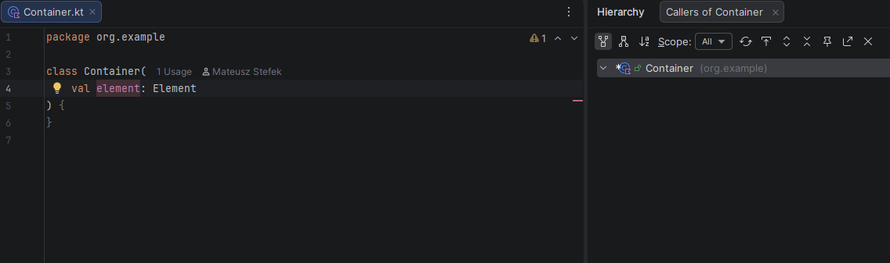

# Bug description

This repository reproduces a bug in Intellij.

- Load this project
- put the cursor on the parameter `element` in `Container`.
- Open "Call Hierarchy"

No usages of `element` are found.

Expected: The call from `Consumer` should be there. 

